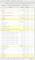
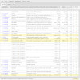
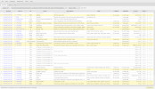
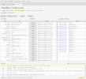
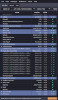
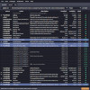
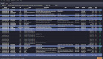
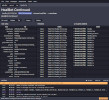

# strongbox, a World of Warcraft addon manager

`strongbox` is an **open source**, **[advertisement free](#recognition)** and **[privacy respecting](#privacy)** addon manager for World of Warcraft.

It runs on Linux and macOS.

It supports addons hosted by ~Curseforge,~ wowinterface, Tukui, Github and Gitlab.

---

***Notice***: Curseforge addons no longer receive updates as of version **5.0.0**, released Feb 1st, 2022.

The **4.x** releases may or may not continue to work for a time [depending on Overwolf's deprecation schedule](https://mailchi.mp/overwolf/whats-new-with-overwolf-curseforge-november3).

Use the *"Source"* and *"Find similar"* actions from the addon context menu ([added **4.9.0**](https://github.com/ogri-la/strongbox/releases)) to help migrate addons away from Curseforge.

I also maintain a list of [other addon managers](https://ogri-la.github.io/wow-addon-managers/).

---

## Installation

Arch Linux users can install `strongbox` from the [AUR](https://aur.archlinux.org/packages/strongbox/) ([mirror](https://github.com/ogri-la/strongbox-pkgbuild/)).

For other Linux users:

1. download: [./releases/strongbox](https://github.com/ogri-la/strongbox/releases/download/4.9.1/strongbox)
2. make executable: `chmod +x strongbox`
3. run: `./strongbox`

If you're on macOS or having a problem with the binary or just prefer Java `.jar` files (requires Java 11+):

1. download: [./releases/strongbox-4.9.1-standalone.jar](https://github.com/ogri-la/strongbox/releases/download/4.9.1/strongbox-4.9.1-standalone.jar)
2. run: `java -jar strongbox-4.9.1-standalone.jar`

## Usage

`strongbox` works by matching your installed addons to a list of addons available online.

Some addons match directly to those online but others require you to manually search and re-install them before that 
match can be made.

Some addons bundle other addons that *do not appear* in the online list. You will need to re-install the 'parent' addon 
that bundled those addons.

First time usage:

1. Select *File -> New addon directory* and select your "Addons" directory (`/path/to/WoW/_retail_/Interface/Addons`)
2. Select *Addons -> Re-install all* to re-install all **matching** addons

Afterwards, use the `Update all` button to update all addons with new versions available.

## Features

* [classic and retail addon support](#classic-and-retail-addon-support)
* [install addons from URL](#install-addons-from-url)
* [catalogue search](#catalogue-search)
* [bulk update](#bulk-update)
* [install addons from multiple sources](#install-addons-from-multiple-sources):
    - ~curseforge~
    - wowinterface
    - tukui
    - github (using *releases*)
    - gitlab (using *releases*)
* [import and export lists of addons](#import-and-export-lists-of-addons)
* [safeguards against bad addons](#safeguards-against-bad-addons)
* [warnings when addons install other bundled addons](#warnings-when-addons-install-other-bundled-addons)
* [ignore addons to prevent accidental changes](#ignore-addons-to-prevent-accidental-changes)
* [mutual dependency tracking](#mutual-dependency-tracking)
* [installing a previous release of an addon](#installing-a-previous-release-of-an-addon)
* [pinning an addon to a specific release](#pinning-an-addon-to-a-specific-release)
* [multi-toc support](#multi-toc-support)
* [release.json support](#releasejson-support)
* [source swapping](#source-swapping)

## Recognition

Under no circumstances whatsoever does this software:

* deal with advertising or advertisers
* collect, monitor or report upon your usage of `strongbox` or your data
* solicit, beg or manipulate for donations
* attempt to monitise you, the user, in any way

This software also tries very hard to not cause a bother - for you *or* the addon host.

I benefit so much from the hard work of those who write free and open source software, including addon developers, 
that it's my privilege to offer this small piece back.

### Special thanks to:

* [bug reporters, complimenters and those with constructive feedback](https://github.com/ogri-la/strongbox/issues)
    - if you guys hadn't reported it, I wouldn't have known to fix it.
* [layday](https://github.com/layday) of [instawow](https://github.com/layday/instawow)
* [vlaaad](https://github.com/vlaaad) of [cljfx](https://github.com/cljfx/cljfx) and his patience

## Privacy

This software interacts with the following remote hosts:

* ~Overwolf/Twitch/Curseforge [Addons API](https://addons-ecs.forgesvc.net/) and its [CDN](https://edge.forgecdn.net/)~
* [wowinterface.com](https://wowinterface.com)
* [www.tukui.org](https://www.tukui.org/api.php)
* [api.github.com](https://developer.github.com/v3/repos/releases)
    - to download repository and release data for addons hosted on Github
    - to download the latest `strongbox` release data
* [gitlab.com](https://gitlab.com)
* [github.com/ogri-la/strongbox-catalogue](https://github.com/ogri-la/strongbox-catalogue), to download addon catalogues

These hosts *may* redirect requests to other hosts.

These interactions use a HTTP user agent header unique to `strongbox` so that it may be identified easily:

    "strongbox/4.x (https://github.com/ogri-la/strongbox)"

Running strongbox with `--debug` will generate a file called "debug.log" that I may ask you to upload if you report a 
bug. *Some* of the details it contains are:

* addons detected in the currently selected addon directory
* paths to strongbox configuration and data:
    - `/home/torkus/.local/share/strongbox`
    - `/home/torkus/.config/strongbox`
* details about your OS and the version of Java in use:
    - `strongbox.version=4.0.0`
    - `os.name=Linux`
    - `os.version=5.10.11-arch1-1`
    - `os.arch=amd64`
    - `java.runtime.name=OpenJDK Runtime Environment`
    - `java.vm.name=OpenJDK 64-Bit Server VM`
    - `java.version=11.0.10`
    - `java.runtime.version=11.0.10+9`
    - `java.vendor.url=https://openjdk.java.net/`
    - `java.version.date=2021-01-19`
    - `java.awt.graphicsenv=sun.awt.X11GraphicsEnvironment`
    - `javafx.version=14`
    - `javafx.runtime.version=14+9`

## Features in detail

### classic and retail addon support

"Classic", "Classic (The Burning Crusade)" and "Retail" versions of WoW are all distinct addon systems.

Some addons support all systems in a single download, some support classic as an alternate release of the same addon, 
some addons support classic only, some addons have been split up into multiple addons. There is a lot of variation.

Click the drop-down next to your addon directory and select either `retail`, `classic` or `classic (TBC)`.

This will restrict the types of addons that can be installed in the current addon directory. 

The `Strict` checkbox allows you to enforce or relax restrictions and mix together addons meant for different systems in 
the same addon directory. If an addon is available for multiple addon systems it will prefer one over another:

* `retail` will prefer `retail` addons, then `classic`, then `classic (TBC)`
* `classic` will prefer `classic` addons, then `classic (TBC)` then `retail`
* `classic (TBC)` will prefer `classic (TBC)` addons, then `classic`, then `retail`

If in doubt which addon system an installed addon supports, look at the value in `WoW` column on the `installed` tab and 
compare it to the `Version` value in the list of WoW [public client builds](https://wowpedia.fandom.com/wiki/Public_client_builds).

### install addons from URL

Strongbox supports installing addons using URLs from addon hosts.

Addons installed this way are always available regardless of the catalogue you've selected.

For example, an addon imported from Github will be available even if you otherwise use Wowinterface addons exclusively.

Click `File` from the top menu and select `Import addon` and paste the URL of the addon you want to install.

### catalogue search

Strongbox supports searching for addons from the following addon hosts:

* ~[curseforge](https://www.curseforge.com/wow/addons)~
* [wowinterface](https://wowinterface.com/addons.php)
* [tukui](https://www.tukui.org)
* [Github](https://github.com)

Click the `search` tab and start typing.

When you search for an addon you are searching a list of thousands of addons that live in a file called a *catalogue*.

Click `Catalogue` from the top menu and choose your preferred catalogue.

The default catalogue is the 'short' catalogue. It contains all addons from all supported hosts that have been *updated* 
since *the beginning of the previous expansion*. This is currently Battle For Azeroth, released 2018-08-14 and the 
catalogue has approximately 7.5k addons.

The 'full' catalogue contains all addons from all supported hosts, ever, and is approximately 15.3k addons large. It 
contains many addons that haven't been updated in years.

There are also per-host catalogues, like a 'wowinterface' catalogue, and strongbox supports selecting between all of them.

Catalogues are updated weekly. New addons released during the week will not be present until the next week. Addons can 
be installed using its URL in these cases.

The 'user' catalogue is a little different. It's initially empty but grows as addons are imported from hosts like Github. 
These addons also appear in search results. Individual addons from the user catalogue are checked for new releases 
normally, but the catalogue itself can only be updated manually.

Click `Catalogue` from the top menu and select `Refresh user catalogue`.

The user catalogue lives at `~/.config/strongbox/user-catalogue.json`.

### bulk update

Many addons can be updated in one operation. Addons with updates available are highlighted.

Click the `Update all` button next to your addon directory.

### install addons from multiple sources

Strongbox supports installing addons from the following addon hosts:

* ~[curseforge](https://www.curseforge.com/wow/addons)~
* [wowinterface](https://wowinterface.com/addons.php)
* [tukui](https://www.tukui.org)
* [github](https://www.github.com)
* [gitlab](https://gitlab.com)

Click the `search` tab and begin typing. Select the addon you wish to install and click the `install selected` button.

Addons hosted on Github and Gitlab must be using releases with custom assets before they can be installed.

#### Github API authentication

Installing and updating addons from Github uses the Github API.

Anonymous usage of the Github API allows 60 requests/hr before your requests are blocked.

Strongbox can authenticate with the Github API by specifying the `GITHUB_TOKEN` *environment variable* using 
a [Personal Access Token](https://docs.github.com/en/github/authenticating-to-github/keeping-your-account-and-data-secure/creating-a-personal-access-token).

Environment variables can be set in many different ways:

* from the shell like: `$ GITHUB_TOKEN=my-secret-token strongbox`
* by modifying `~/.config/plasma-workspace/env` [for KDE](https://userbase.kde.org/Session_Environment_Variables/en) and setting `GITHUB_TOKEN=my-secret-token`
* by modifying `~/.profile` [for Gnome](https://help.ubuntu.com/community/EnvironmentVariables) and setting `GITHUB_TOKEN=my-secret-token`
* system-wide (affecting all users) by modifying `/etc/environment` and setting `GITHUB_TOKEN=my-secret-token`

### import and export lists of addons

Your list of addons can be *exported* to a simple format that allows them to be *imported* again later.

Click `File` and then select `Export list of addons`.

This allows for simple backups of the *current addon directory* and the sharing of lists of addons.

Addons installed using `File -> Import addon` in *any* addon directory can be exported as a single list.

Click `File` and then select `Export the user-catalogue`.

### safeguards against bad addons

Addon `.zip` files that contain top-level files or top-level directories missing a `.toc` file **will not be installed**
and the downloaded `.zip` file will be deleted. This is a guard against poorly or maliciously constructed `.zip` files.

Corrupted zip files that cannot be read or decompressed will be deleted.

### warnings when addons install other bundled addons

A warning is issued when an addon is unzipped and contains multiple *inconsistently named* directories.

For example, installing [RealUI](https://github.com/RealUI/RealUI) will emit this warning:

> RealUI will also install these addons: Kui_Media, Kui_Nameplates, Kui_Nameplates_Core, Kui_Nameplates_Core_Config, RealUI_Bugs, RealUI_Inventory, RealUI_Skins, RealUI_Tooltips, BadBoy, BadBoy_Guilded, BadBoy_CCleaner, Raven, Raven_Options, nibRealUI, nibRealUI_Config, Masque, Clique, Skada, Bartender4

It is up to the user to decide if this is OK or not.

### ignore addons to prevent accidental changes

When an addon is ignored strongbox will not attempt to find that addon in the catalogue, look for or download updates or 
even allow the installation of other addons that may alter the ignored addon or any of its files.

Right-click an addon and select `Ignore` or `Stop ignoring`.

Addons under development are automatically ('implicitly') ignored.

### mutual dependency tracking

A 'mutual dependency' in strongbox is when 'Addon A' installs an addon called 'Addon Z' and 'Addon B' *also* installs 
'Addon Z'.

Both 'Addon A' and 'Addon B' depend on 'Addon Z' and if 'Addon A' were uninstalled it would (probably) break 'Addon B'.

In this scenario strongbox allows 'Addon B' to overwrite 'Addon Z' but keeps track of the fact that 'Addon A' is also 
using it. When either 'Addon A' or 'Addon B' are uninstalled, 'Addon Z' is preserved.

The state of 'Addon Z' isn't guaranteed however. 

'Addon A' may install a very old 'Addon Z' while 'Addon B' overwrites that with a brand new version. 'Addon A' is now 
using a different version of 'Addon Z' than it expects. Or vice versa. 

It's messy but only one 'Addon Z' can exist at a time.

### installing a previous release of an addon

An addon host may make previous releases of an addon available to download.

Right-click an addon and select `Release`.

Strongbox currently supports installing previous releases for:

* ~Curseforge~
* Github
* Gitlab

### pinning an addon to a specific release

Once an addon has been installed it can be 'pinned' to that specific release like a tack in a corkboard.

Right-click an addon and select `Pin release`.

Pinned addons won't be marked as having updates available and other addons won't be able to overwrite the files of a 
pinned addon.

### multi-toc support

Introduced [in May 2021](https://github.com/Stanzilla/WoWUIBugs/issues/68#issuecomment-889431675), the WoW game client 
supports searching for multiple `.toc` files based on a suffix (or lack of one). 

For example, `SomeAddon-Classic.toc` will be preferred in the classic game client over `SomeAddon.toc`.

Strongbox also searches for and reads the toc data from the most appropriate file.

Multiple toc files also help determine if an update is required or not.

### release.json support

The `release.json` file is generated by [BigWigsMods/packager](https://github.com/BigWigsMods/packager) and includes 
extra information about files in a Github/Gitlab 'release'.

No documentation or specification seems to exist for it but there are [plenty of examples](https://github.com/layday/github-wow-addon-catalogue/blob/main/addons.csv).

Because another HTTP request is required to download the file it is only consulted for the latest release and only if
the game tracks for a release can't be otherwise guessed.

### source swapping

An installed addon comes from a specific addon host or *source*. An addon in it's `.toc` file may include the details of
other sources where it can be found.

For example, WeakAuras can be found on Github and wowinterface.

To see addons with other sources, go to `View -> Columns` and click `other sources`.

To switch an addon between sources, right-click an addon with other sources and select `Source`.

## Misc

User configuration is stored in `~/.config/strongbox` unless run with the envvar `$XDG_CONFIG_HOME` set.

Temporary data is stored in `~/.local/share/strongbox` unless run with the envvar `$XDG_DATA_HOME` set.

Addon zip files are downloaded to your WoW `Addons` directory. See `Preferences -> Remove addon zip after installation`.

A file called `.strongbox.json` is created within newly installed or re-installed addons. This file maps specific 
attributes between the addon host (like wowinterface.com) and the addon as well as *across* addons, as some addons unzip 
to multiple directories. It's a simple `txt` file in a structured format called `json`.

Addon zip files, `.strongbox.json` files, old `.wowman.json` files, cached data and `WowMatrix.dat` files can all be 
removed from the `Cache` menu.

Addon `.rar` and `.tar.gz` files are not supported. You can find a few of these on wowinterface.com.

## Releases, bugs, questions, feedback, contributing

Changes are recorded in the [CHANGELOG.md](CHANGELOG.md) file.

All bugs/questions/requests/feedback should go in [Github Issues](https://github.com/ogri-la/strongbox/issues).

I prefer to **not** receive *code* contributions. See [CONTRIBUTING](CONTRIBUTING.md) for more detail.

Prior to `1.0.0`, `strongbox` was known as `wowman`. The [AUR package](https://aur.archlinux.org/packages/wowman) for 
`wowman` is obsolete.

## Other addon managers

**Moved here: https://ogri-la.github.io/wow-addon-managers/**

[Request a change](https://github.com/ogri-la/strongbox-comrades/issues). 

## License

Copyright © 2018-2022 Torkus

Distributed under the GNU Affero General Public Licence, version 3 [with additional permissions](LICENCE.txt#L665)
