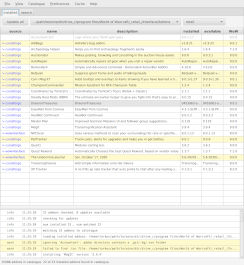
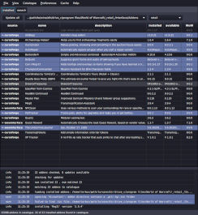

# strongbox, a World of Warcraft addon manager

`strongbox` is an **open source**, **[advertisement free](#recognition)** and **[privacy respecting](#privacy)** addon manager for World of Warcraft.

It supports Linux and macOS.

It supports addons hosted by Curseforge, wowinterface, Tukui and Github.

 

## Installation

Arch Linux users can install `strongbox` from the [AUR](https://aur.archlinux.org/packages/strongbox/) ([mirror](https://github.com/ogri-la/strongbox-pkgbuild/)).

For other Linux users:

1. download: [./releases/strongbox](https://github.com/ogri-la/strongbox/releases/download/3.3.0/strongbox)
2. make executable: `chmod +x strongbox`
3. run: `./strongbox`

If you're on macOS or just prefer Java `.jar` files (requires Java 11+):

1. download: [./releases/strongbox-3.3.0-standalone.jar](https://github.com/ogri-la/strongbox/releases/download/3.3.0/strongbox-3.3.0-standalone.jar)
2. run: `java -jar strongbox-3.3.0-standalone.jar`

## Usage

`strongbox` works by matching your installed addons to a list of addons available online.

Some addons match directly to those online but others require you to manually search and re-install them before that 
match can be made.

Some addons bundle other addons that *do not appear* in the online list. You will need to re-install the 'parent' addon 
that bundled those addons.

First time usage:

1. Select *File -> New addon directory* and select your "Addons" directory (`/path/to/WoW/_retail_/Interface/Addons`)
2. Select *Addons -> Re-install all* to re-install all **matching** addons

Afterwards, use the `Update all` button to update all addons with new versions available.

## Features

* [classic and retail addon support](#classic-and-retail-addon-support)
* [catalogue search](#catalogue-search)
* [bulk update](#bulk-update)
* [install addons from multiple sources](#install-addons-from-multiple-sources):
    - [curseforge](https://www.curseforge.com/wow/addons)
    - [wowinterface](https://wowinterface.com/addons.php)
    - [tukui](https://www.tukui.org)
    - [github](https://www.github.com) using *releases*
* [import and export of lists of addons](#import-and-export-lists-of-addons)
* [safeguards against bad addons](#safeguards-against-bad-addons)
* [warnings when addons install other bundled addons](#warnings-when-addons-install-other-bundled-addons)
* [ignore addons to prevent accidental changes](#ignore-addons-to-prevent-accidental-changes)
* [mutual dependency tracking](#mutual-dependency-tracking)
* [installing a previous release of an addon](#installing-a-previous-release-of-an-addon)
* [pinning an addon to a specific release](#pinning-an-adodn-to-a-specific-release)

## Recognition

Under no circumstances whatsoever does this software:

* deal with advertising or advertisers
* collect, monitor or report upon your usage of `strongbox` or your data
* solicit, beg or manipulate for donations
* attempt to monitise you, the user, in any way

This software also tries very hard to not cause a bother - for you *or* the addon host.

I benefit so much from the hard work of those who write free and open source software, including addon developers, 
that it's my privilege to offer this small piece back.

### Special thanks to:

* [bug reporters, complimenters and those with constructive feedback](https://github.com/ogri-la/strongbox/issues)
    - if you guys hadn't reported it, I wouldn't have known to fix it.
* [layday](https://github.com/layday) of [instawow](https://github.com/layday/instawow)
* [vlaaad](https://github.com/vlaaad) of [cljfx](https://github.com/cljfx/cljfx) and his patience

## Privacy

This software interacts with the following remote hosts:

* Overwolf/Twitch/Curseforge [Addons API](https://addons-ecs.forgesvc.net/) and its [CDN](https://edge.forgecdn.net/)
* [wowinterface.com](https://wowinterface.com)
* [www.tukui.org](https://www.tukui.org/api.php)
* [api.github.com](https://developer.github.com/v3/repos/releases)
    - to download repository and release data for addons hosted on Github
    - to download the latest `strongbox` release data
* [github.com/ogri-la/strongbox-catalogue](https://github.com/ogri-la/strongbox-catalogue), to download addon catalogues

These hosts *may* redirect requests to other hosts.

These interactions use a HTTP user agent header unique to `strongbox` so that it may be identified easily:

    "strongbox/4.0 (https://github.com/ogri-la/strongbox)"

Running strongbox with `--debug` will generate a file called "debug.log" that I may ask you to upload if you report a 
bug. *Some* of the details it contains are:

* addons detected in the currently selected addon directory
* your machine's `hostname`
* paths to strongbox configuration and data:
    - `/home/torkus/.local/share/strongbox`
    - `/home/torkus/.config/strongbox`
* details about your OS and the version of Java in use:
    - `strongbox.version=4.0.0`
    - `os.name=Linux`
    - `os.version=5.10.11-arch1-1`
    - `os.arch=amd64`
    - `java.runtime.name=OpenJDK Runtime Environment`
    - `java.vm.name=OpenJDK 64-Bit Server VM`
    - `java.version=11.0.10`
    - `java.runtime.version=11.0.10+9`
    - `java.vendor.url=https://openjdk.java.net/`
    - `java.version.date=2021-01-19`
    - `java.awt.graphicsenv=sun.awt.X11GraphicsEnvironment`
    - `javafx.version=14`
    - `javafx.runtime.version=14+9`

## Features in detail

### classic and retail addon support

Addon developers, addon hosts and addon managers all scrambled to accommodate 'classic' WoW when it was released.

Addons for 'classic' WoW are not the same as very old addons for vanilla WoW. 

Some addons support both retail and classic in a single download, some support classic as an 'alternate' download, some support classic only or vice versa, some addons have been split into two.

Click the drop-down next to your addon directory and select either `retail` or `classic` or `any, prefer retail` or `any, prefer classic`.

This will restrict the types of addons that can be installed in to the current addon directory. The last two options allow you to mix classic and retail addons together in the same addon directory. If an addon is available for both retail and classic it will prefer one over the other.

### catalogue search

Strongbox supports searching for addons from the following addon hosts:

* [curseforge](https://www.curseforge.com/wow/addons)
* [wowinterface](https://wowinterface.com/addons.php)
* [tukui](https://www.tukui.org)

Click the `search` tab and start typing.

When you search for an addon you are searching a list of thousands of addons that live in a file called a *catalogue*.

Click `Catalogue` from the top menu and choose your preferred catalogue.

The default catalogue is the 'short' catalogue. It contains all addons from all supported hosts that have been *updated* since *the beginning of the previous expansion*. This is currently Battle For Azeroth, released 2018-08-14 and the catalogue has approximately 7.5k addons.

The 'full' catalogue contains all addons from all supported hosts, ever, and is approximately 15.3k addons large. It contains many addons that haven't been updated in years.

There are also per-host catalogues and strongbox supports selecting between them.

Catalogues are updated weekly.

The 'user' catalogue is a little different. It's initially empty but grows as addons are imported from hosts like Github. These addons do appear in search results. Individual addons from the user catalogue are checked for new releases normally, but the catalogue itself can only be updated manually.

Click `Catalogue` from the top menu and select `Refresh user catalogue`.

The user catalogue lives at `~/.config/strongbox/user-catalogue.json`.

### bulk update

Many addons can be updated in one operation. Addons with updates available are highlighted.

Click the `Update all` button next to your addon directory.

### install addons from multiple sources

Strongbox supports installing addons from the following addon hosts:

* [curseforge](https://www.curseforge.com/wow/addons)
* [wowinterface](https://wowinterface.com/addons.php)
* [tukui](https://www.tukui.org)
* [github](https://www.github.com), using *releases*

Click the `search` tab and begin typing. Select the addon you wish to install and click the `install selected` button.

Addons hosted on Github must meet [certain requirements](./github-addons.md) before they can be installed.

### import and export of lists of addons

Your list of addons can be *exported* to a simple format that allows them to be *imported* again later.

Click `File` and then select `Export list of addons`.

This allows for simple backups of the *current addon directory* and the sharing of lists of addons.

Github addons installed in *any* addon directory can be exported as a single list.

Click `File` and then select `Export Github addon list`.

### safeguards against bad addons

If a downloaded addon is corrupt or does not adhere to the common addon folder structure then it will not be unzipped and will be deleted.

### warnings when addons install other bundled addons

A warning is issued when an addon is unzipped and contains multiple *inconsistently named* directories.

For example, installing [RealUI](https://github.com/RealUI/RealUI) will emit this warning:

> RealUI will also install these addons: Kui_Media, Kui_Nameplates, Kui_Nameplates_Core, Kui_Nameplates_Core_Config, RealUI_Bugs, RealUI_Inventory, RealUI_Skins, RealUI_Tooltips, BadBoy, BadBoy_Guilded, BadBoy_CCleaner, Raven, Raven_Options, nibRealUI, nibRealUI_Config, Masque, Clique, Skada, Bartender4

It is up to the user to decide if this is OK or not.

### ignore addons to prevent accidental changes

When an addon is ignored strongbox will not attempt to find that addon in the catalogue, look for or download updates or even allow the installation of other addons that may alter the ignored addon or any of its files.

Right-click an addon and select `Ignore` or `Stop ignoring`.

Addons under development are automatically ('implicitly') ignored.

### mutual dependency tracking

A 'mutual dependency' in strongbox is when 'Addon A' installs an addon called 'Addon Z' and 'Addon B' *also* installs 'Addon Z'.

Both 'Addon A' and 'Addon B' depend on 'Addon Z' and if 'Addon A' were uninstalled it would (probably) break 'Addon B'.

In this scenario strongbox allows 'Addon B' to overwrite 'Addon Z' but keeps track of the fact that 'Addon A' is also using it. When either 'Addon A' or 'Addon B' are uninstalled, 'Addon Z' is preserved.

The state of 'Addon Z' isn't guaranteed however. 

'Addon A' may install a very old 'Addon Z' while 'Addon B' overwrites that with a brand new version. 'Addon A' is now using a different version of 'Addon Z' than it expects. Or vice versa. 

It's messy but only one 'Addon Z' can exist at a time.

### installing a previous release of an addon

An addon host may make previous releases of an addon available to download.

Right-click an addon and select `Release`.

Strongbox currently supports installing previous releases for:

* Curseforge
* Github

### pinning an addon to a specific release

Once an addon has been installed it can be 'pinned' to that specific release like a tack in a corkboard.

Right-click an addon and select `Pin release`.

Pinned addons won't be marked as having updates available and other addons won't be able to overwrite the files of a pinned addon.

## Notes

Original Swing GUI was last available in v3 using: `./strongbox --ui gui1`

Prior to `1.0.0`, `strongbox` was known as `wowman`. The [AUR package](https://aur.archlinux.org/packages/wowman) for `wowman` is obsolete.

User configuration is stored in `~/.config/strongbox` unless run with the envvar `$XDG_CONFIG_HOME` set.

Temporary data is stored in `~/.local/share/strongbox` unless run with the envvar `$XDG_DATA_HOME` set.

Addon zip files are downloaded to your WoW `Addons` directory. See `Preferences -> Remove addon zip after installation`.

A file called `.strongbox.json` is created within newly installed or re-installed addons. This file maps specific 
attributes between the addon host (like curseforge.com) and the addon as well as *across* addons, as some addons unzip 
to multiple directories. It's a simple `txt` file in a structured format called `json`.

Addon zip files, `.strongbox.json` files, old `.wowman.json` files, cached data and `WowMatrix.dat` files can all be 
removed from the `Cache` menu.

Addon `.zip` files that contain top-level files or top-level directories missing a `.toc` file **will not be installed**
and the downloaded `.zip` file will be deleted. This is a guard against poorly or maliciously constructed `.zip` files.

Addon `.rar` and `.tar.gz` files are not supported. You can find a few of these on wowinterface.com.

## Releases, bugs, questions, feedback, contributing

Changes are recorded in the [CHANGELOG.md](CHANGELOG.md) file.

All bugs/questions/feedback should go in [Github Issues](https://github.com/ogri-la/strongbox/issues).

All code contributions should take the form of a pull request with unit tests.  
[The licence](LICENCE.txt) is quite strict and all code contributions are subject to it.

See [CONTRIBUTING](CONTRIBUTING.md) for more detail.

## Other addon managers

**Moved here: https://ogri-la.github.io/wow-addon-managers/**

[Request a change](https://github.com/ogri-la/strongbox-comrades/issues). 

## License

Copyright © 2018-2021 Torkus

Distributed under the GNU Affero General Public Licence, version 3 [with additional permissions](LICENCE.txt#L665)
