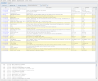
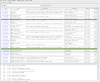
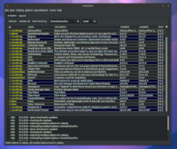
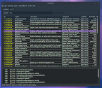

# wowman, a World of Warcraft Addon Manager

`wowman` is an **open source**, **advertisement free** and **privacy respecting** addon manager for World of Warcraft. 

It supports addons hosted by Curseforge, wowinterface, Tukui and Github.

If you are a user of wowman and you ever want to get in touch, please just [open an issue](https://github.com/ogri-la/wowman/issues) or [PM me on reddit](https://www.reddit.com/message/compose/?to=torkus-jr&subject=wowman)

## Audience

This software is for World of Warcraft players using Linux.

It also works on macOS.

It does not work on Windows. Windows will never be supported.

## Requirements

* Java 8+

## Installation

1. [download the jar](https://github.com/ogri-la/wowman/releases/download/0.12.1/wowman-0.12.1-standalone.jar) file
2. run with `java -jar wowman-x.x.x-standalone.jar`

### Arch Linux users

A PKGBUILD exists in the AUR [here](https://aur.archlinux.org/packages/wowman/) 
with a mirror [here](https://github.com/ogri-la/wowman-pkgbuild/).

Once installed it's available from the command line as `wowman`.

## Screenshots

 
 
 
 

## Usage

`wowman` works by matching your installed addons to a list of addons available online.

Some addons match directly to those online but others require you to manually search and re-install them before that 
match can be made.

Some addons come bundled with other addons that *do not appear* in the online list. You will need to re-install the 
'parent' addon that bundles those addons.

First time usage:

1. select your "Addons" directory (`/path/to/WoW/_retail_/Interface/Addons`)
2. from the `Addons` menu select `Re-install all` to automatically re-install all **matching** addons
3. addons that are **not** automatically matched can be searched for and installed from the `search` tab
4. finally, addons can be deleted by selecting them, right-clicking, and selecting `delete`. Multiple addons can be 
selected and removed at once.

Afterwards, simply use the `Update all` button to update all addons with new versions available. 
Addons with new versions available will be highlighted.

## Recognition

Under no circumstances whatsoever does this software:

* deal with advertising or advertisers
* collect, monitor or report upon your usage of `wowman` or your data
* attempt to monitise you, the user, in any way

This software also tries very hard to:

* be plain and uncomplicated
* do the least surprising thing
* clean up after itself
* not cause a bother - for you *or* the addon host

I benefit so much from the hard work of those who write free and open source software, including addon developers, 
that it's my privilege to offer this small piece back.

## Features

* classic and retail addon support
* catalogue search
* bulk update
* addons from multiple sources:
    - [curseforge](https://www.curseforge.com/wow/addons)
    - [wowinterface](https://wowinterface.com/addons.php)
    - [github](./github-addons.md) using *releases*
    - [tukui](https://www.tukui.org)
* import and export of lists of addons
* safeguards against bad addons
* warnings when addons install other bundled addons

## Notes

User configuration is stored in `~/.config/wowman` unless run with the envvar `$XDG_CONFIG_HOME` set.

Temporary data is stored in `~/.local/share/wowman` unless run with the envvar `$XDG_DATA_HOME` set.

Addon zip files are downloaded to your WoW `Addons` directory.

A file called `.wowman.json` is created within newly installed or re-installed addons. This file maps specific 
attributes between the addon host (like curseforge.com) and the addon as well as *across* addons, as some addons unzip 
to multiple directories. It's a simple `txt` file in a structured format called `json`.

Addon zip files, `.wowman.json` files, cached data and `WowMatrix.dat` files can all be removed from the `Cache` menu.

Addon `.zip` files that contain top-level files or top-level directories missing a `.toc` file **will not be installed**
and the downloaded `.zip` file will be deleted immediately. This is a guard against poorly or maliciously constructed
`.zip` files.

Addon `.rar` files are not supported.

This software interacts with the following remote hosts:

* Twitch (Curseforge) [Addons API](https://addons-ecs.forgesvc.net/) and it's [CDN](https://edge.forgecdn.net/)
* [wowinterface.com](https://wowinterface.com)
* [www.tukui.org](https://www.tukui.org/api.php)
* [api.github.com](https://developer.github.com/v3/repos/releases)
    - to download repository and release data for addons hosted on Github
    - to download the latest `wowman` release data
* [github.com/ogri-la/wowman-data](https://github.com/ogri-la/wowman-data), to download addon catalogues

These hosts *may* redirect requests.

These interactions use a HTTP user agent header unique to `wowman` so that it may be identified easily.

## Releases, bugs, questions, feedback, contributing

Changes are recorded in the [CHANGELOG.md](CHANGELOG.md) file.

All bugs/questions/feedback should go in [Github Issues](https://github.com/ogri-la/wowman/issues) or 
via a Reddit [private message](https://www.reddit.com/message/compose/?to=torkus-jr&subject=wowman).

All code contributions should take the form of a pull request with unit tests.  
[The licence](LICENCE.txt) is quite strict and all code contributions are subject to it.

See [CONTRIBUTING](CONTRIBUTING.md) for more detail.

## Other addon managers

**Moved here: https://ogri-la.github.io/wow-addon-managers/**

An addon manager is 'maintained' if it has seen an update in 12 months.

When an addon manager requires the *separate* installation of other software like Python or Java or NPM or GTK/QT etc, 
or requires compilation or similar, then it gets the big fat caveat asterisk '**\***'.

If a packaged version of the addon manager exists for *at least one* distribution of Linux, I drop the caveat asterisk.
This may be an AUR, DEB, RPM/DNF, Snap, Flatpak, Zypper, AppImage, etc.

## License

Copyright © 2018-2020 Torkus

Distributed under the GNU Affero General Public Licence, version 3 [with additional permissions](LICENCE.txt#L665)
