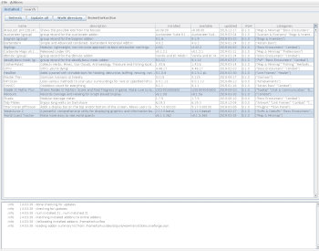

# wowman, a World of Warcraft Addon Manager

`wowman` is **open source**, **advertisement free** and **privacy respecting** software that interfaces with 
[www.curseforge.com](https://www.curseforge.com/wow/addons) and World of Warcraft addon files in your `Addons` 
directory.

## Audience

This software targets World of Warcraft users using Linux.

It may work on other platforms but it is only tested and supported on Linux.

## Requirements

* Java 8+

## Usage

1. [download the jar](https://github.com/ogri-la/wowman/releases/download/0.4.0/wowman-0.4.0-standalone.jar) file
2. run with `java -jar wowman-x.x.x-standalone.jar`
3. select your `Addons` directory (`/path/to/WoW/_retail_/Interface/Addons`)
4. select the addons you wish to update and click the `update` button

## Notes

A sub-directory called `state` will be created in the current directory. All configuration and cached data lives there.

Addon zip files are downloaded to your WoW `Addons` directory.

A file called `.wowman.json` is created within newly installed addons. This maps specific attributes between 
www.curseforge.com and the unpacked addon, as well as across addons that unpack to multiple directories.

This software interacts with the following remote hosts:

* [https://www.curseforge.com](https://www.curseforge.com), to download detailed addon data
* [https://github.com/ogri-la](https://github.com/ogri-la), to download a list of summary addon information

These interactions use a HTTP user agent header unique to `wowman` so it may be identified easily

## Releases, bugs, questions, feedback, contributing

Changes are recorded in the [CHANGELOG.md](CHANGELOG.md) file.

All bugs/questions/feedback should go in [Issues](https://github.com/ogri-la/wowman/issues).

All contributions should take the form of a pull request with unit tests.  
[The licence](LICENCE.txt) is quite strict and all contributions will be subject to it.

See [CONTRIBUTING](CONTRIBUTING.md) for more detail.

## Recognition

Under no circumstances whatsoever does this software:

* deal with advertising or advertisers
* collect, monitor or report upon your usage of `wowman` or your data
* attempt to monitise you, the user, in any way

This software also tries very hard to:

* be plain and uncomplicated
* do the least surprising thing
* clean up after itself
* not cause a bother - for you *or* curseforge

I benefit so much from the hard work of those who write free and open source software, including addon developers, 
that it's my privilege to offer this small piece back.

## Other unofficial addon managers

| name                  | url                                             | Linux | Mac  | Windows | maintained? | f/oss? | source available? | 
|-----------------------|-------------------------------------------------|-------|------|---------|-------------|--------|-------------------| 
| vargen2/addon-manager | https://github.com/vargen2/addonmanager         | no    | no   | yes     | no          | no     | yes               | 
| GWAM                  | https://github.com/JonasKnarbakk/GWAM           | yes*  | yes* | yes*    | yes         | yes    | yes               | 
| Minion                | https://minion.mmoui.com/                       | yes*  | yes  | yes     | yes         | no     | no                | 
| Tukui Client          | https://www.tukui.org/download.php?client=win   | no    | no   | yes     | yes         | no     | no                | 
| WorldOfAddons         | https://github.com/WorldofAddons/worldofaddons  | yes*  | yes* | yes     | yes         | yes    | yes               | 
| WoWAceUpdater         | https://sourceforge.net/projects/wowaceupdater/ | no    | no   | yes     | no          | yes    | yes               | 
| wowaddon              | https://github.com/wttw/wowaddon                | yes   | yes  | yes     | no          | yes    | yes               | 
| wow-addon-manager     | https://github.com/qwezarty/wow-addon-manager   | yes*  | no   | no      | yes         | yes    | yes               | 
| wowam                 | https://github.com/sysworx/wowam                | no    | yes  | yes     | no          | no     | yes               | 
| wow-better-cli        | https://github.com/DayBr3ak/wow-better-cli      | yes*  | yes* | yes*    | no          | yes    | yes               | 
| wowmatrix             | https://www.wowmatrix.com/                      | yes   | yes  | yes     | yes         | no     | no                | 
| WoWutils              | https://github.com/SeriousBug/WoWutils          | yes   | no   | no      | no          | yes    | yes               | 

\* with caveats. may require compilation, partial functionality or not work at all, or be officially unsupported, or ...

## License

Copyright © 2018-2019 Torkus

Distributed under the GNU Affero General Public Licence, version 3 [with additional permissions](LICENCE.txt#L665)
