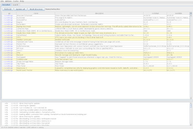
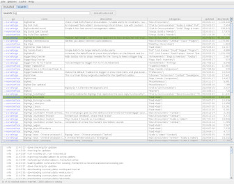

# wowman, a World of Warcraft Addon Manager

`wowman` is an **open source**, **advertisement free** and **privacy respecting** addon manager for World of Warcraft. 
It interacts with [www.curseforge.com](https://www.curseforge.com/wow/addons) and 
[wowinterface.com](https://wowinterface.com/addons.php) and with the addons in your `Addons` directory.

## Audience

This software targets World of Warcraft players using Linux.

It may work on other platforms but it is only tested and supported on Linux.

## Requirements

* Java 8+

## Installation

1. [download the jar](https://github.com/ogri-la/wowman/releases/download/0.7.2/wowman-0.7.2-standalone.jar) file
2. run with `java -jar wowman-x.x.x-standalone.jar`

### Arch Linux users

A PKGBUILD exists in the AUR [here](https://aur.archlinux.org/packages/wowman/) 
with a mirror [here](https://github.com/ogri-la/wowman-pkgbuild/). 

Once installed it's available from the command line as `wowman`.

## Usage

`wowman` works by matching your installed addons to a list of addons available online.

Some addons match directly to those online but others require you to manually search and re-install them before that 
match can be made.

Some addons come bundled with other addons that *do not appear* in the online list. You will need to re-install the 
'parent' addon that bundles those addons.

First time usage:

1. select your "Addons" directory (`/path/to/WoW/_retail_/Interface/Addons`)
2. from the `Addons` menu select `Re-install all` to automatically re-install all **matching** addons
3. addons that are **not** automatically matched can be searched for and installed from the `search` tab
4. finally, addons can be deleted by selecting them, right-clicking, and selecting `delete`. Multiple addons can be 
selected and removed at once.

Afterwards, simply use the `Update all` button to update all addons with new versions available. 
Addons with new versions available will be highlighted.

## Recognition

Under no circumstances whatsoever does this software:

* deal with advertising or advertisers
* collect, monitor or report upon your usage of `wowman` or your data
* attempt to monitise you, the user, in any way

This software also tries very hard to:

* be plain and uncomplicated
* do the least surprising thing
* clean up after itself
* not cause a bother - for you *or* the addon host

I benefit so much from the hard work of those who write free and open source software, including addon developers, 
that it's my privilege to offer this small piece back.

 

## Notes

User configuration is stored in `~/.config/wowman` unless run with the envvar `$XDG_CONFIG_HOME` set.

Temporary data is stored in `~/.local/share/wowman` unless run with the envvar `$XDG_DATA_HOME` set.

Addon zip files are downloaded to your WoW `Addons` directory.

A file called `.wowman.json` is created within newly installed or re-installed addons. This file maps specific 
attributes between the addon host (like curseforge.com) and the addon as well as *across* addons, as some addons unzip 
to multiple directories. It's a simple `txt` file in a structured format called `json`.

Addon zip files, `.wowman.json` files, cached data and `WowMatrix.dat` files can all be removed from the `Cache` menu.

Addon `.zip` files that contain top-level files or top-level directories missing a `.toc` file **will not be installed**
and the downloaded `.zip` file will be deleted immediately. This is a guard against poorly or maliciously constructed
`.zip` files.

Addon `.rar` files are not and will not be supported.

This software interacts with the following remote hosts:

* [www.curseforge.com](https://www.curseforge.com) and [wowinterface.com](https://wowinterface.com) to download detailed 
addon data. These hosts may redirect requests.
* [github.com/ogri-la](https://github.com/ogri-la), to download a list of summary addon information
* [api.github.com](https://developer.github.com/v3/repos/releases), to download the latest `wowman` release data

These interactions use a HTTP user agent header unique to `wowman` so that it may be identified easily.

## Releases, bugs, questions, feedback, contributing

Changes are recorded in the [CHANGELOG.md](CHANGELOG.md) file.

All bugs/questions/feedback should go in [Github Issues](https://github.com/ogri-la/wowman/issues) or 
via a Reddit [private message](https://www.reddit.com/message/compose/?to=torkus-jr&subject=wowman).

All code contributions should take the form of a pull request with unit tests.  
[The licence](LICENCE.txt) is quite strict and all code contributions are subject to it.

See [CONTRIBUTING](CONTRIBUTING.md) for more detail.

## Other unofficial addon managers

### Maintained 

(I think)

| name                        | url                                            | Linux | Mac  | Windows | maintained? | f/oss? | source available? | ads? | EULA? | language   | 
|-----------------------------|------------------------------------------------|-------|------|---------|-------------|--------|-------------------|------|-------|------------| 
| addon                       | https://github.com/vargen2/Addon               | no    | no   | yes     | yes         | yes    | yes               | no   | no    | C#         | 
| instawow                    | https://github.com/layday/instawow             | yes*  | yes* | yes*    | yes         | yes    | yes               | no   | no    | python     | 
| lcurse                      | https://github.com/ephraim/lcurse              | yes   | no   | no      | yes         | no     | yes               | no   | no    | python     | 
| Minion                      | https://minion.mmoui.com/                      | yes*  | yes  | yes     | yes         | no     | no                | yes  | yes   | java       | 
| Saionaro/wow-addons-updater | https://github.com/Saionaro/wow-addons-updater | yes   | yes  | yes     | yes         | yes    | yes               | no   | no    | javascript | 
| Tukui Client                | https://www.tukui.org/download.php?client=win  | no    | no   | yes     | yes         | no     | no                | ?    | ?     | ?          | 
| WorldOfAddons               | https://github.com/WorldofAddons/worldofaddons | yes*  | yes* | yes     | yes         | yes    | yes               | no   | no    | javascript | 
| wow-addon-manager           | https://github.com/qwezarty/wow-addon-manager  | yes*  | no   | no      | yes         | yes    | yes               | no   | no    | python     | 
| wowa                        | https://github.com/antiwinter/wowa             | yes*  | yes* | yes*    | yes         | yes    | no                | no   | no    | javascript | 
| wowmatrix                   | https://www.wowmatrix.com/                     | yes   | yes  | yes     | yes         | no     | no                | yes  | yes   | ?          | 

\* with caveats. may require compilation, partial functionality or not work at all, or be officially unsupported, or ...

(see [comrades.csv](comrades.csv))

### Unmaintained 

(I think)

| name                        | url                                             | Linux | Mac  | Windows | maintained? | f/oss? | source available? | ads? | EULA? | language   | 
|-----------------------------|-------------------------------------------------|-------|------|---------|-------------|--------|-------------------|------|-------|------------| 
| addon-manager               | https://github.com/vargen2/addonmanager         | no    | no   | yes*    | no          | yes    | yes               | no   | no    | java       | 
| GWAM                        | https://github.com/JonasKnarbakk/GWAM           | yes*  | yes* | yes*    | no^         | yes    | yes               | no   | no    | c++        | 
| kuhnertdm/wow-addon-updater | https://github.com/kuhnertdm/wow-addon-updater  | yes*  | yes  | yes     | no^         | yes    | yes               | no   | no    | python     | 
| wow-better-cli              | https://github.com/DayBr3ak/wow-better-cli      | yes*  | yes* | yes*    | no^         | yes    | yes               | no   | no    | javascript | 
| WoWAceUpdater               | https://sourceforge.net/projects/wowaceupdater/ | no    | no   | yes     | no          | yes    | yes               | ?    | ?     | ?          | 
| wowaddon                    | https://github.com/wttw/wowaddon                | yes   | yes  | yes     | no^         | yes    | yes               | no   | no    | go         | 
| wowam                       | https://github.com/sysworx/wowam                | no    | yes  | yes     | no^         | no     | yes               | no   | yes*  | xojo       | 
| WoWutils                    | https://github.com/SeriousBug/WoWutils          | yes   | no   | no      | no          | yes    | yes               | no   | no    | bash       | 

\* with caveats. may require compilation, partial functionality or not work at all, or be officially unsupported, or ...

\^ hasn't seen an update in over a year. It may be extremely stable bug-free software or it may be unmaintained.

(see [fallen-comrades.csv](fallen-comrades.csv))

## License

Copyright © 2018-2019 Torkus

Distributed under the GNU Affero General Public Licence, version 3 [with additional permissions](LICENCE.txt#L665)
