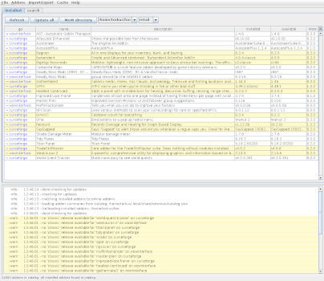
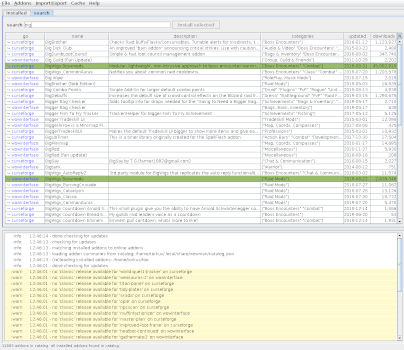

# wowman, a World of Warcraft Addon Manager

`wowman` is an **open source**, **advertisement free** and **privacy respecting** addon manager for World of Warcraft. 
It interacts with the Twitch (Curseforge) [Addons API](https://addons-ecs.forgesvc.net) and 
[wowinterface.com](https://wowinterface.com/addons.php) and with the addons in your `Addons` directory.

## Audience

This software targets World of Warcraft players using Linux.

It may work on other platforms but it is only tested and supported on Linux.

## Requirements

* Java 8+

## Installation

1. [download the jar](https://github.com/ogri-la/wowman/releases/download/0.9.2/wowman-0.9.2-standalone.jar) file
2. run with `java -jar wowman-x.x.x-standalone.jar`

### Arch Linux users

A PKGBUILD exists in the AUR [here](https://aur.archlinux.org/packages/wowman/) 
with a mirror [here](https://github.com/ogri-la/wowman-pkgbuild/). 

Once installed it's available from the command line as `wowman`.

## Usage

`wowman` works by matching your installed addons to a list of addons available online.

Some addons match directly to those online but others require you to manually search and re-install them before that 
match can be made.

Some addons come bundled with other addons that *do not appear* in the online list. You will need to re-install the 
'parent' addon that bundles those addons.

First time usage:

1. select your "Addons" directory (`/path/to/WoW/_retail_/Interface/Addons`)
2. from the `Addons` menu select `Re-install all` to automatically re-install all **matching** addons
3. addons that are **not** automatically matched can be searched for and installed from the `search` tab
4. finally, addons can be deleted by selecting them, right-clicking, and selecting `delete`. Multiple addons can be 
selected and removed at once.

Afterwards, simply use the `Update all` button to update all addons with new versions available. 
Addons with new versions available will be highlighted.

## Recognition

Under no circumstances whatsoever does this software:

* deal with advertising or advertisers
* collect, monitor or report upon your usage of `wowman` or your data
* attempt to monitise you, the user, in any way

This software also tries very hard to:

* be plain and uncomplicated
* do the least surprising thing
* clean up after itself
* not cause a bother - for you *or* the addon host

I benefit so much from the hard work of those who write free and open source software, including addon developers, 
that it's my privilege to offer this small piece back.

 

## Notes

User configuration is stored in `~/.config/wowman` unless run with the envvar `$XDG_CONFIG_HOME` set.

Temporary data is stored in `~/.local/share/wowman` unless run with the envvar `$XDG_DATA_HOME` set.

Addon zip files are downloaded to your WoW `Addons` directory.

A file called `.wowman.json` is created within newly installed or re-installed addons. This file maps specific 
attributes between the addon host (like curseforge.com) and the addon as well as *across* addons, as some addons unzip 
to multiple directories. It's a simple `txt` file in a structured format called `json`.

Addon zip files, `.wowman.json` files, cached data and `WowMatrix.dat` files can all be removed from the `Cache` menu.

Addon `.zip` files that contain top-level files or top-level directories missing a `.toc` file **will not be installed**
and the downloaded `.zip` file will be deleted immediately. This is a guard against poorly or maliciously constructed
`.zip` files.

Addon `.rar` files are not and will not be supported.

This software interacts with the following remote hosts:

* Twitch (Curseforge) [Addons API](https://addons-ecs.forgesvc.net/) and it's [CDN](https://edge.forgecdn.net/) to 
download detailed addon data.
* [wowinterface.com](https://wowinterface.com) to download detailed addon data. These hosts may redirect requests.
* [github.com/ogri-la](https://github.com/ogri-la), to download a collated list of summary addon data
* [api.github.com](https://developer.github.com/v3/repos/releases), to download the latest `wowman` release data

These interactions use a HTTP user agent header unique to `wowman` so that it may be identified easily.

## Releases, bugs, questions, feedback, contributing

Changes are recorded in the [CHANGELOG.md](CHANGELOG.md) file.

All bugs/questions/feedback should go in [Github Issues](https://github.com/ogri-la/wowman/issues) or 
via a Reddit [private message](https://www.reddit.com/message/compose/?to=torkus-jr&subject=wowman).

All code contributions should take the form of a pull request with unit tests.  
[The licence](LICENCE.txt) is quite strict and all code contributions are subject to it.

See [CONTRIBUTING](CONTRIBUTING.md) for more detail.

## Other addon managers

**NEW! A more convenient version here: https://ogri-la.github.io/wow-addon-managers/**

An addon manager is 'maintained' if it has seen an update in 12 months.

See [comrades.csv](comrades.csv) for a complete list.

### Maintained 

| Name                           | URL                                                  | Maintained | Linux | Mac  | Windows | UI  | Retail | Classic | F/OSS | Source Available | Ads | EULA | Language   | 
|--------------------------------|------------------------------------------------------|------------|-------|------|---------|-----|--------|---------|-------|------------------|-----|------|------------| 
| antiwinter/wowa                | https://github.com/antiwinter/wowa                   | yes        | yes*  | yes* | yes*    | CLI | yes    | yes     | yes   | yes              | no  | no   | Javascript | 
| AvidWeb/cursebreaker           | https://github.com/AcidWeb/CurseBreaker              | yes        | no    | no   | yes     | TUI | yes    | yes     | yes   | yes              | no  | no   | Python     | 
| braier/wow-addon-updater       | https://www.braier.net/wow-addon-updater/index.html  | yes        | yes   | yes  | yes     | GUI | yes    | no      | yes   | yes              | no  | no   | Pascal     | 
| dark0dave/wow-addon-updater    | https://gitlab.com/dark0dave/wow-addon-updater       | yes        | yes*  | yes  | yes     | CLI | yes    | yes     | yes   | yes              | no  | no   | Python     | 
| ephraim/lcurse                 | https://github.com/ephraim/lcurse                    | yes        | yes   | no   | no      | GUI | yes    | no      | no    | yes              | no  | no   | Python     | 
| erikabp123/ClassicAddonManager | https://github.com/erikabp123/ClassicAddonManager    | yes        | no    | no   | yes     | GUI | no     | yes     | yes   | yes              | no  | no   | Java       | 
| grrttedwards/wow-addon-updater | https://github.com/grrttedwards/wow-addon-updater    | yes        | yes*  | yes  | yes     | CLI | yes    | yes     | yes   | yes              | no  | no   | Python     | 
| karolswdev/wow                 | https://github.com/karolswdev/wow                    | yes        | no    | no   | yes     | CLI | no     | yes     | no    | yes              | no  | no   | C#         | 
| layday/instawow                | https://github.com/layday/instawow                   | yes        | yes*  | yes* | yes*    | CLI | yes    | yes     | yes   | yes              | no  | no   | Python     | 
| Lund259/WoW-Addon-Manager      | https://github.com/Lund259/WoW-Addon-Manager         | yes        | no    | no   | yes     | GUI | yes    | no      | yes   | yes              | no  | no   | C#         | 
| Minion                         | https://minion.mmoui.com/                            | yes        | yes*  | yes  | yes     | GUI | yes    | yes     | no    | no               | yes | yes  | Java       | 
| nazarov-tech/wowa              | https://github.com/nazarov-tech/wowa                 | yes        | yes*  | yes* | yes     | CLI | yes    | no      | yes   | yes              | no  | no   | Python     | 
| OpenAddOnManager               | https://github.com/OpenAddOnManager/OpenAddOnManager | yes        | no    | no   | yes     | GUI | yes    | no      | yes   | yes              | no  | no   | C#         | 
| qwezarty/wow-addon-manager     | https://github.com/qwezarty/wow-addon-manager        | yes        | yes*  | no   | no      | CLI | yes    | no      | yes   | yes              | no  | no   | Python     | 
| Saionaro/wow-addons-updater    | https://github.com/Saionaro/wow-addons-updater       | yes        | yes   | yes  | yes     | GUI | yes    | no      | yes   | yes              | no  | no   | Javascript | 
| Tukui Client                   | https://www.tukui.org/download.php?client=win        | yes        | no    | no   | yes     | GUI | yes    | no      | no    | no               | ?   | ?    | ?          | 
| vargen2/Addon                  | https://github.com/vargen2/Addon                     | yes        | no    | no   | yes     | GUI | yes    | yes     | yes   | yes              | no  | no   | C#         | 
| woblight/GitAddonsManager      | https://gitlab.com/woblight/GitAddonsManager         | yes        | yes   | no   | yes     | GUI | yes    | no      | yes   | yes              | no  | no   | C++        | 
| WorldOfAddons                  | https://github.com/WorldofAddons/worldofaddons       | yes        | yes*  | yes* | yes     | GUI | yes    | no      | yes   | yes              | no  | no   | Javascript | 

\* installation on this platform is more involved than running a simple executable

### Unmaintained 

| Name                        | URL                                             | Maintained | Linux | Mac  | Windows | UI  | Retail | Classic | F/OSS | Source Available | Ads | EULA | Language   | 
|-----------------------------|-------------------------------------------------|------------|-------|------|---------|-----|--------|---------|-------|------------------|-----|------|------------| 
| DayBr3ak/wow-better-cli     | https://github.com/DayBr3ak/wow-better-cli      | no         | yes*  | yes* | yes*    | CLI | yes    | no      | yes   | yes              | no  | no   | Javascript | 
| JonasKnarbakk/GWAM          | https://github.com/JonasKnarbakk/GWAM           | no         | yes*  | yes* | yes*    | GUI | yes    | no      | yes   | yes              | no  | no   | C++        | 
| kuhnertdm/wow-addon-updater | https://github.com/kuhnertdm/wow-addon-updater  | no         | yes*  | yes  | yes     | CLI | yes    | no      | yes   | yes              | no  | no   | Python     | 
| SeriousBug/WoWutils         | https://github.com/SeriousBug/WoWutils          | no         | yes   | no   | no      | CLI | yes    | no      | yes   | yes              | no  | no   | Bash       | 
| sysworx/wowam               | https://github.com/sysworx/wowam                | no         | no    | yes  | yes     | GUI | yes    | no      | no    | yes              | no  | yes* | XOJO       | 
| vargen2/addon-manager       | https://github.com/vargen2/addonmanager         | no         | no    | no   | yes*    | GUI | yes    | no      | yes   | yes              | no  | no   | Java       | 
| WoWAceUpdater               | https://sourceforge.net/projects/wowaceupdater/ | no         | no    | no   | yes     | GUI | yes    | no      | yes   | yes              | ?   | ?    | ?          | 
| wttw/wowaddon               | https://github.com/wttw/wowaddon                | no         | yes   | yes  | yes     | CLI | yes    | no      | yes   | yes              | no  | no   | Go         | 

\* installation on this platform is more involved than running a simple executable

## License

Copyright © 2018-2019 Torkus

Distributed under the GNU Affero General Public Licence, version 3 [with additional permissions](LICENCE.txt#L665)
