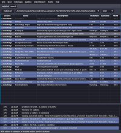

# strongbox, a World of Warcraft Addon Manager

`strongbox` is an **open source**, **advertisement free** and **privacy respecting** addon manager for World of Warcraft.

It supports Linux and macOS.

It supports addons hosted by Curseforge, wowinterface, Tukui and Github.

 

## Installation

Arch Linux users can install `strongbox` from the [AUR](https://aur.archlinux.org/packages/strongbox/) ([mirror](https://github.com/ogri-la/strongbox-pkgbuild/)).

For everyone else:

1. download it: [strongbox](https://github.com/ogri-la/strongbox/releases/download/3.0.0/strongbox)
2. make it executable: `chmod +x strongbox`
3. run it: `./strongbox`

If you prefer Java `.jar` files:

1. download it: [strongbox-3.0.0-standalone.jar](https://github.com/ogri-la/strongbox/releases/download/3.0.0/strongbox-3.0.0-standalone.jar)
2. run it: `java -jar strongbox-x.x.x-standalone.jar`

`.jar` file requires Java 11+

## Usage

`strongbox` works by matching your installed addons to a list of addons available online.

Some addons match directly to those online but others require you to manually search and re-install them before that 
match can be made.

Some addons bundle other addons that *do not appear* in the online list. You will need to re-install the 'parent' addon 
that bundled those addons.

First time usage:

1. Select *File -> New addon directory* and select your "Addons" directory (`/path/to/WoW/_retail_/Interface/Addons`)
2. Select *Addons -> Re-install all* to re-install all **matching** addons

Afterwards, use the `Update all` button to update all addons with new versions available.

## Recognition

Under no circumstances whatsoever does this software:

* deal with advertising or advertisers
* collect, monitor or report upon your usage of `strongbox` or your data
* attempt to monitise you, the user, in any way

This software also tries very hard to:

* be plain and uncomplicated
* do the least surprising thing
* clean up after itself
* not cause a bother - for you *or* the addon host

I benefit so much from the hard work of those who write free and open source software, including addon developers, 
that it's my privilege to offer this small piece back.

## Features

* classic and retail addon support
* catalogue search
* bulk update
* install addons from multiple sources:
    - [curseforge](https://www.curseforge.com/wow/addons)
    - [wowinterface](https://wowinterface.com/addons.php)
    - [tukui](https://www.tukui.org)
    - [github](./github-addons.md) using *releases*
* import and export of lists of addons
* safeguards against bad addons
* warnings when addons install other bundled addons
* lock addons to prevent changes
* mutual dependency tracking and safer addon uninstallation

## Notes

Original GUI is still available with: `./strongbox --ui gui1`

Prior to `1.0.0`, `strongbox` was known as `wowman`. The [AUR package](https://aur.archlinux.org/packages/wowman) for `wowman` is obsolete.

User configuration is stored in `~/.config/strongbox` unless run with the envvar `$XDG_CONFIG_HOME` set.

Temporary data is stored in `~/.local/share/strongbox` unless run with the envvar `$XDG_DATA_HOME` set.

Addon zip files are downloaded to your WoW `Addons` directory.

A file called `.strongbox.json` is created within newly installed or re-installed addons. This file maps specific 
attributes between the addon host (like curseforge.com) and the addon as well as *across* addons, as some addons unzip 
to multiple directories. It's a simple `txt` file in a structured format called `json`.

Addon zip files, `.strongbox.json` files, old `.wowman.json` files, cached data and `WowMatrix.dat` files can all be 
removed from the `Cache` menu.

Addon `.zip` files that contain top-level files or top-level directories missing a `.toc` file **will not be installed**
and the downloaded `.zip` file will be deleted immediately. This is a guard against poorly or maliciously constructed
`.zip` files.

Addon `.rar` and `.tar.gz` files are not supported. You can find a few of these on wowinterface.com.

This software interacts with the following remote hosts:

* Overwolf/Twitch/Curseforge [Addons API](https://addons-ecs.forgesvc.net/) and it's [CDN](https://edge.forgecdn.net/)
* [wowinterface.com](https://wowinterface.com)
* [www.tukui.org](https://www.tukui.org/api.php)
* [api.github.com](https://developer.github.com/v3/repos/releases)
    - to download repository and release data for addons hosted on Github
    - to download the latest `strongbox` release data
* [github.com/ogri-la/strongbox-catalogue](https://github.com/ogri-la/strongbox-catalogue), to download addon catalogues

These hosts *may* redirect requests to other hosts.

These interactions use a HTTP user agent header unique to `strongbox` so that it may be identified easily.

## Releases, bugs, questions, feedback, contributing

Changes are recorded in the [CHANGELOG.md](CHANGELOG.md) file.

All bugs/questions/feedback should go in [Github Issues](https://github.com/ogri-la/strongbox/issues).

All code contributions should take the form of a pull request with unit tests.  
[The licence](LICENCE.txt) is quite strict and all code contributions are subject to it.

See [CONTRIBUTING](CONTRIBUTING.md) for more detail.

## Other addon managers

**Moved here: https://ogri-la.github.io/wow-addon-managers/**

[Request a change](https://github.com/ogri-la/strongbox-comrades/issues). 

## License

Copyright © 2018-2020 Torkus

Distributed under the GNU Affero General Public Licence, version 3 [with additional permissions](LICENCE.txt#L665)
