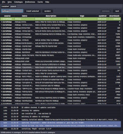

# strongbox, a World of Warcraft Addon Manager

`strongbox` is an **open source**, **advertisement free** and **privacy respecting** addon manager for World of Warcraft.

It supports Linux and macOS.

It supports addons hosted by Curseforge, wowinterface, Tukui and Github.

 

## Installation

Arch Linux users can install `strongbox` from the [AUR](https://aur.archlinux.org/packages/strongbox/) ([mirror](https://github.com/ogri-la/strongbox-pkgbuild/)).

For other Linux users:

1. download: [./releases/strongbox](https://github.com/ogri-la/strongbox/releases/download/3.3.0/strongbox)
2. make executable: `chmod +x strongbox`
3. run: `./strongbox`

If you're on macOS or just prefer Java `.jar` files (requires Java 11+):

1. download: [./releases/strongbox-3.3.0-standalone.jar](https://github.com/ogri-la/strongbox/releases/download/3.3.0/strongbox-3.3.0-standalone.jar)
2. run: `java -jar strongbox-3.3.0-standalone.jar`

## Usage

`strongbox` works by matching your installed addons to a list of addons available online.

Some addons match directly to those online but others require you to manually search and re-install them before that 
match can be made.

Some addons bundle other addons that *do not appear* in the online list. You will need to re-install the 'parent' addon 
that bundled those addons.

First time usage:

1. Select *File -> New addon directory* and select your "Addons" directory (`/path/to/WoW/_retail_/Interface/Addons`)
2. Select *Addons -> Re-install all* to re-install all **matching** addons

Afterwards, use the `Update all` button to update all addons with new versions available.

## Features

* classic and retail addon support
* catalogue search
* bulk update
* install addons from multiple sources:
    - [curseforge](https://www.curseforge.com/wow/addons)
    - [wowinterface](https://wowinterface.com/addons.php)
    - [tukui](https://www.tukui.org)
    - [github](https://www.github.com) using *releases*
* import and export of lists of addons
* safeguards against bad addons
* warnings when addons install other bundled addons
* ignore addons to prevent accidental changes
* mutual dependency tracking and safer addon uninstallation
* installing a previous release of an addon
* pinning an addon to a specific release

## Recognition

Under no circumstances whatsoever does this software:

* deal with advertising or advertisers
* collect, monitor or report upon your usage of `strongbox` or your data
* solicit, beg or manipulate for donations
* attempt to monitise you, the user, in any way

This software also tries very hard to not cause a bother - for you *or* the addon host.

I benefit so much from the hard work of those who write free and open source software, including addon developers, 
that it's my privilege to offer this small piece back.

### Special thanks to:

* [bug reporters, complimenters and those with constructive feedback](https://github.com/ogri-la/strongbox/issues)
    - if you guys hadn't reported it, I wouldn't have known to fix it.
* [layday](https://github.com/layday) of [instawow](https://github.com/layday/instawow)
* [vlaaad](https://github.com/vlaaad) of [cljfx](https://github.com/cljfx/cljfx) and his patience

## Privacy

This software interacts with the following remote hosts:

* Overwolf/Twitch/Curseforge [Addons API](https://addons-ecs.forgesvc.net/) and it's [CDN](https://edge.forgecdn.net/)
* [wowinterface.com](https://wowinterface.com)
* [www.tukui.org](https://www.tukui.org/api.php)
* [api.github.com](https://developer.github.com/v3/repos/releases)
    - to download repository and release data for addons hosted on Github
    - to download the latest `strongbox` release data
* [github.com/ogri-la/strongbox-catalogue](https://github.com/ogri-la/strongbox-catalogue), to download addon catalogues

These hosts *may* redirect requests to other hosts.

These interactions use a HTTP user agent header unique to `strongbox` so that it may be identified easily.

Running strongbox with `--debug` will generate a file called "debug.log" that I may ask you to upload if you report a 
bug. Please review the contents of this file before you upload. *Some* of the details it contains are:

* addons detected in the currently selected addon directory
* your machine's `hostname`
* paths to strongbox configuration and data:
    - /home/torkus/.local/share/strongbox
    - /home/torkus/.config/strongbox
* details about your OS and the version of Java in use:
    - strongbox.version=3.3.0
    - os.name=Linux
    - os.version=5.10.11-arch1-1
    - os.arch=amd64
    - java.runtime.name=OpenJDK Runtime Environment
    - java.vm.name=OpenJDK 64-Bit Server VM
    - java.version=11.0.10
    - java.runtime.version=11.0.10+9
    - java.vendor.url=https://openjdk.java.net/
    - java.version.date=2021-01-19
    - java.awt.graphicsenv=sun.awt.X11GraphicsEnvironment
    - javafx.version=14
    - javafx.runtime.version=14+9

## Notes

Original Swing GUI was last available in v3 using: `./strongbox --ui gui1`

Prior to `1.0.0`, `strongbox` was known as `wowman`. The [AUR package](https://aur.archlinux.org/packages/wowman) for `wowman` is obsolete.

User configuration is stored in `~/.config/strongbox` unless run with the envvar `$XDG_CONFIG_HOME` set.

Temporary data is stored in `~/.local/share/strongbox` unless run with the envvar `$XDG_DATA_HOME` set.

Addon zip files are downloaded to your WoW `Addons` directory. See `Preferences -> Remove addon zip after installation`.

A file called `.strongbox.json` is created within newly installed or re-installed addons. This file maps specific 
attributes between the addon host (like curseforge.com) and the addon as well as *across* addons, as some addons unzip 
to multiple directories. It's a simple `txt` file in a structured format called `json`.

Addon zip files, `.strongbox.json` files, old `.wowman.json` files, cached data and `WowMatrix.dat` files can all be 
removed from the `Cache` menu.

Addon `.zip` files that contain top-level files or top-level directories missing a `.toc` file **will not be installed**
and the downloaded `.zip` file will be deleted. This is a guard against poorly or maliciously constructed `.zip` files.

Addon `.rar` and `.tar.gz` files are not supported. You can find a few of these on wowinterface.com.

### classic and retail addon support

WoW Classic was introduced and addon managers and hosts scrambled to accommodate addons that supported 'retail', or 
'classic' or both.

'classic' WoW is *not* just an older instance of 'retail' WoW. Very old vanilla addons are not guaranteed to work to 
work on the newer 'classic' WoW.

No addon host currently handles this state well. Curseforge is complete but fat in some places, wrong in others, truncated in yet others. The wowinterface API is a mix of plain wrong and missing data. Tukui has two instances of the same API and is 
probably the sanest.

[I suspect there will be BC and WotLK coming next](https://blizzardwatch.com/2021/02/12/will-wow-classic-incorporate-burning-crusade/)
and the state of classic and retail addon support will only get messier.

Strongbox calls these different versions of WoW 'tracks'. It supports 'classic' and 'retail' game tracks as best it can, given the state of addon host support.

### catalogue search

Strongbox uses lists of addons it creates from publicly available and accessible addon hosts and uses these 'catalogues' to find and install addons.

The default catalogue strongbox uses is the 'short' catalogue. It contains all addons from all supported hosts that have been updated since the beginning of the previous expansion. At time of writing this is Battle For Azeroth, released 2018-08-14. The short catalogue is naturally truncated on each new expansion.

The other catalogues available are 'full' (all addons from all hosts, ever) and per-host catalogues, so you can opt to use addons only from wowinterface or cursefurge or tukui if you'd prefer.

Catalogues are updated weekly.

There is also the 'user' catalogue that is empty but grows as the user (you) imports addons from hosts like Github. These addons also appear in search results and you may opt to install from a bleeding-edge development version of an addon than from a traditional host.

### bulk update

Many addons can be downloaded and installed in one operation.

### install addons from multiple sources

Strongbox supports the following addon hosts:

* [curseforge](https://www.curseforge.com/wow/addons)
* [wowinterface](https://wowinterface.com/addons.php)
* [tukui](https://www.tukui.org)
* [github](https://www.github.com) using *releases*

Addons hosted on Github must be [configured in a certain way](./github-addons.md) and make use of Github's 'releases' 
feature.

### import and export of lists of addons

Your list of addons can be *exported* to a simple format that allows them to be *imported* again later.

This allows for simple backups and sharing of lists of addons.

### safeguards against bad addons

If a downloaded addon is corrupt or does not adhere to the common addon folder structure then it will not be unzipped and will be deleted.

### warnings when addons install other bundled addons

A warning is issued when an addon is unzipped and contains multiple directories with inconsistent naming.

For example, installing [RealUI](https://github.com/RealUI/RealUI) will emit this warning:

> RealUI will also install these addons: Kui_Media, Kui_Nameplates, Kui_Nameplates_Core, Kui_Nameplates_Core_Config, RealUI_Bugs, RealUI_Inventory, RealUI_Skins, RealUI_Tooltips, BadBoy, BadBoy_Guilded, BadBoy_CCleaner, Raven, Raven_Options, nibRealUI, nibRealUI_Config, Masque, Clique, Skada, Bartender4

Strongbox leaves it to the user to decide if this is legitimate or not.

### ignore addons to prevent accidental changes

Addons can be 'ignored' and strongbox will not attempt to find that addon in the catalogue, look for or download updates or even allow the installation of other addons that may overwrite the ignored addon or any of its files.

Right-click an addon and select `Ignore` or `Stop ignoring`.

Addons under development are automatically ('implicitly') ignored.

### mutual dependency tracking and safer addon uninstallation

A 'mutual dependency' in strongbox is when 'Addon A' installs an addon called 'Addon Z' and 'Addon B' *also* installs 'Addon Z'.

Both 'Addon A' and 'Addon B' depend on 'Addon Z' and if 'Addon A' were uninstalled it would (probably) break 'Addon B'.

In this scenario strongbox allows 'Addon B' to overwrite 'Addon Z' but keeps track of the fact that 'Addon A' is also using it. When either 'Addon A' or 'Addon B' are uninstalled, 'Addon Z' is preserved.

The state of 'Addon Z' isn't guaranteed however. 

'Addon A' may install a very old 'Addon Z' while 'Addon B' overwrites that with a brand new version. 'Addon A' is now using a different version of 'Addon Z' than it expects. Or vice versa. 

It's messy but only one 'Addon Z' can exist at a time.

### installing a previous release of an addon

An addon host may make previous releases of an addon available to download.

Right-click an addon and select `Release`.

Strongbox currently supports installing previous releases for:

* Curseforge
* Github

### pinning an addon to a specific release

Once an addon has been installed it can be 'pinned' to that specific release like a tack in a corkboard.

Right-click an addon and select `Pin release`.

Pinned addons won't be marked as having updates available and other addons won't be able to overwrite the files of a pinned addon.

## Releases, bugs, questions, feedback, contributing

Changes are recorded in the [CHANGELOG.md](CHANGELOG.md) file.

All bugs/questions/feedback should go in [Github Issues](https://github.com/ogri-la/strongbox/issues).

All code contributions should take the form of a pull request with unit tests.  
[The licence](LICENCE.txt) is quite strict and all code contributions are subject to it.

See [CONTRIBUTING](CONTRIBUTING.md) for more detail.

## Other addon managers

**Moved here: https://ogri-la.github.io/wow-addon-managers/**

[Request a change](https://github.com/ogri-la/strongbox-comrades/issues). 

## License

Copyright © 2018-2021 Torkus

Distributed under the GNU Affero General Public Licence, version 3 [with additional permissions](LICENCE.txt#L665)
